# SELECT

## 1. Показати всіх користувачів
```sql
SELECT * FROM users;
```
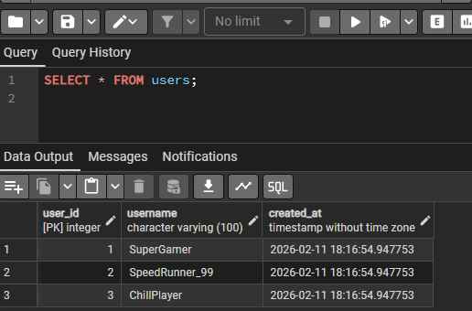

---

## 2. Показати всі рівні
```sql
SELECT * FROM levels;
```
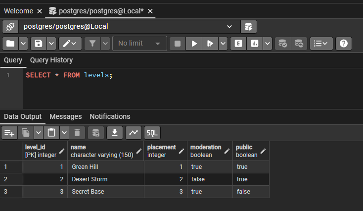

---

## 3. Показати всі голоси
```sql
SELECT * FROM votes;
```
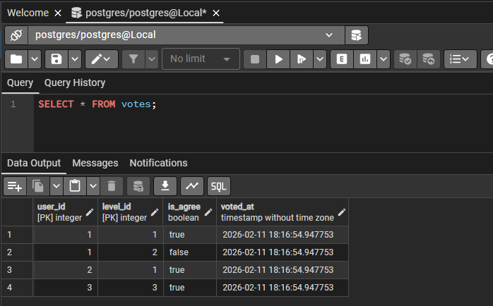

---

## 4. Отримати тільки імена користувачів
```sql
SELECT username FROM users;
```
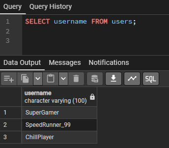

---

## 5. Отримати назви рівнів та їх складність (placement)
```sql
SELECT name, placement FROM levels;
```
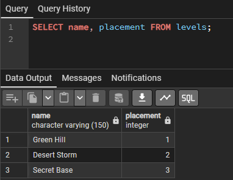

---

## 6. Знайти тільки ПУБЛІЧНІ рівні (ті, що не приховані)
```sql
SELECT * FROM levels 
WHERE public = TRUE;
```
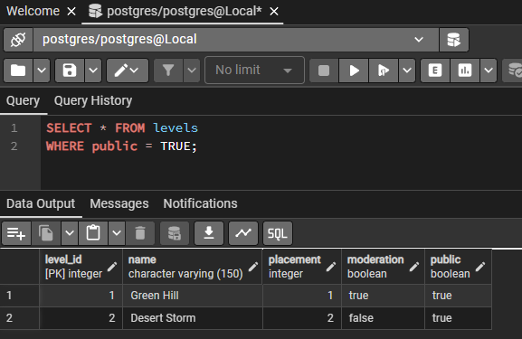

---

## 7. Знайти рівні, які складніші за перший (placement > 1)
```sql
SELECT name, placement FROM levels 
WHERE placement > 1;
```
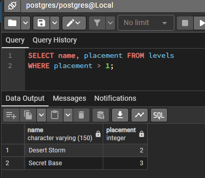

---

## 8. Знайти всі ПОЗИТИВНІ голоси (лайки)
```sql
SELECT * FROM votes 
WHERE is_agree = TRUE;
```
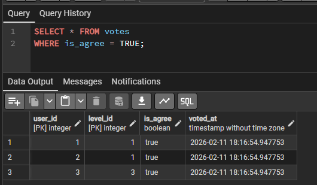

---

## 9. Хто за що проголосував (з іменами замість цифр)
```sql
SELECT 
    users.username AS Гравець, 
    levels.name AS Рівень, 
    votes.is_agree AS Лайк
FROM votes
JOIN users ON votes.user_id = users.user_id
JOIN levels ON votes.level_id = levels.level_id;
```
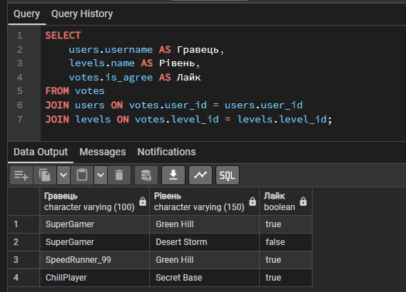

---

# INSERT

## 1. Додавання нового користувача
```sql
INSERT INTO users (username) VALUES ('Pro_Gamer_2024');
SELECT * FROM users;
```
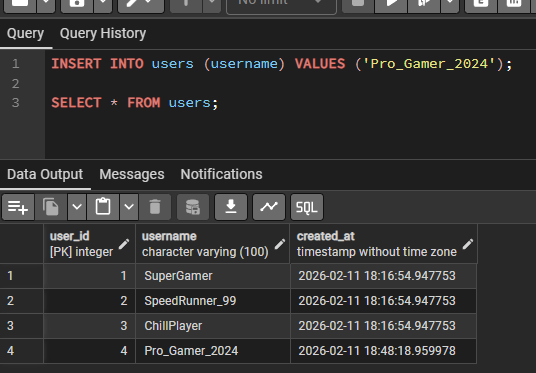

---

## 2. Додавання нового рівня
```sql
INSERT INTO levels (name, placement, moderation, public) VALUES ('Impossible Mode', 10, TRUE, TRUE);
```
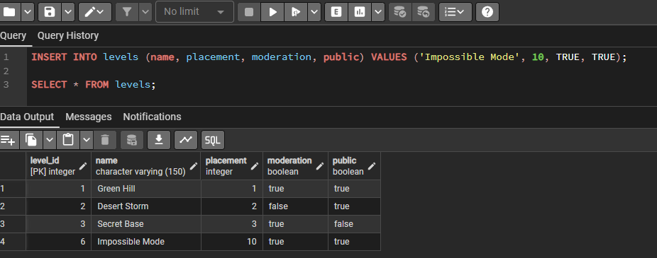

---

## 2. Додавання нового голосу
```sql
INSERT INTO votes (user_id, level_id, is_agree) VALUES (3, 6, FALSE);
SELECT * FROM votes WHERE user_id = 3;
```
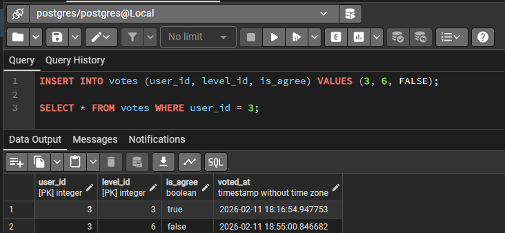

---