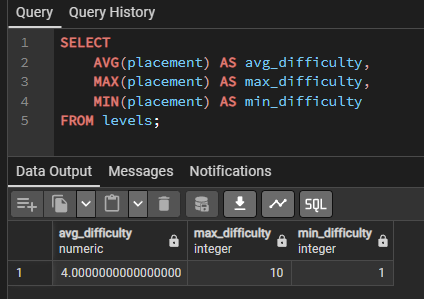
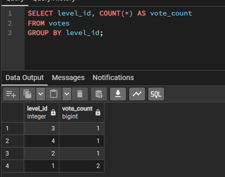
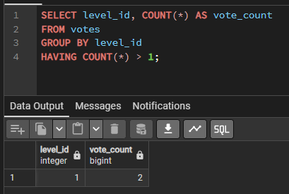
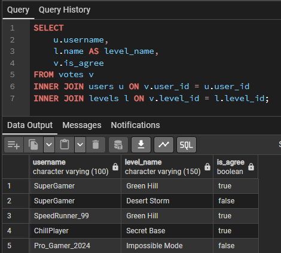
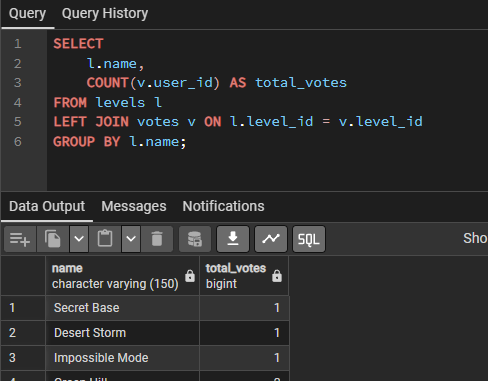
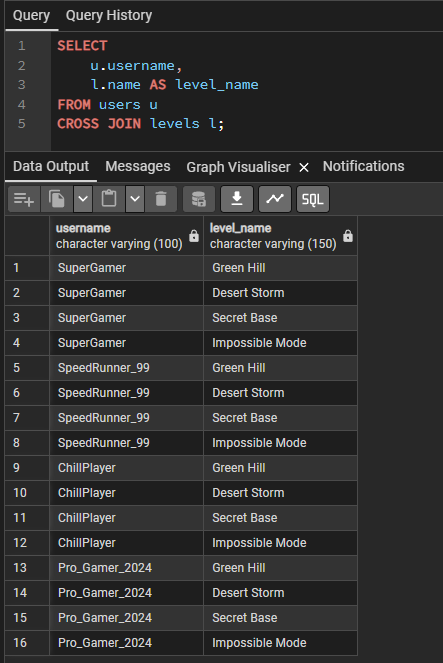
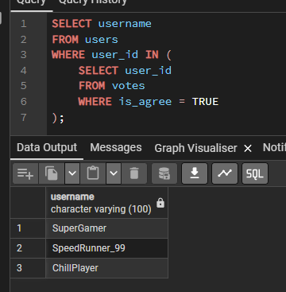
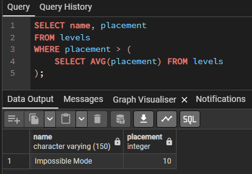

# ЧАСТИНА 1: АГРЕГАЦІЯ ТА ГРУПУВАННЯ (Мінімум 4 запити)

---

## Базова агрегація (COUNT)
Підрахувати загальну кількість голосів у системі.
```sql
SELECT COUNT(*) AS total_votes 
FROM votes;
```


---

## Агрегація (AVG, MAX, MIN)
Знайти середню, максимальну та мінімальну складність (placement) рівнів.
```sql
SELECT 
    AVG(placement) AS avg_difficulty,
    MAX(placement) AS max_difficulty,
    MIN(placement) AS min_difficulty
FROM levels;
```


---

## Групування (GROUP BY)
Підрахувати кількість голосів за кожен рівень (виводимо ID рівня і кількість).
```sql
SELECT level_id, COUNT(*) AS vote_count
FROM votes
GROUP BY level_id;
```


---

## Фільтрування груп (HAVING)
Знайти ID рівнів, за які проголосувало більше 1 користувача.
```sql
SELECT level_id, COUNT(*) AS vote_count
FROM votes
GROUP BY level_id
HAVING COUNT(*) > 1;
```


---

# ЧАСТИНА 2: ОБ'ЄДНАННЯ ТАБЛИЦЬ (JOINs) (Мінімум 3 запити)

---

## INNER JOIN (Багатотаблична вибірка)
Отримати список: Ім'я гравця, Назва рівня, Як проголосував (True/False).
Показує тільки ті записи, де є збіги у всіх таблицях.
```sql
SELECT 
    u.username, 
    l.name AS level_name, 
    v.is_agree
FROM votes v
INNER JOIN users u ON v.user_id = u.user_id
INNER JOIN levels l ON v.level_id = l.level_id;
```


---

## LEFT JOIN
Рахуємо кількість голосів, використовуючи user_id
```sql
SELECT 
    l.name, 
    COUNT(v.user_id) AS total_votes
FROM levels l
LEFT JOIN votes v ON l.level_id = v.level_id
GROUP BY l.name;
```


---

## CROSS JOIN (Декартовий добуток)
Створити матрицю "всі можливі голоси".
Показує комбінацію кожного юзера з кожним рівнем.
```sql
SELECT 
    u.username, 
    l.name AS level_name
FROM users u
CROSS JOIN levels l;
```


---

# ЧАСТИНА 3: ПІДЗАПИТИ (SUBQUERIES) (Мінімум 3 запити)

---

## Підзапит у WHERE
Знайти імена користувачів, які поставили хоча б один лайк (is_agree = TRUE).
```sql
SELECT username 
FROM users 
WHERE user_id IN (
    SELECT user_id 
    FROM votes 
    WHERE is_agree = TRUE
);
```


---

## Підзапит у SELECT
Вивести назву рівня та кількість лайків (TRUE), підраховану "на льоту" підзапитом.
```sql
SELECT 
    name, 
    (SELECT COUNT(*) FROM votes WHERE level_id = levels.level_id AND is_agree = TRUE) AS likes_count
FROM levels;
```


---

## Підзапит з агрегацією (WHERE + Scalar Subquery)
Знайти рівні, складність (placement) яких вища за середню складність усіх рівнів.
```sql
SELECT name, placement 
FROM levels 
WHERE placement > (
    SELECT AVG(placement) FROM levels
);
```


---