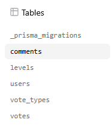
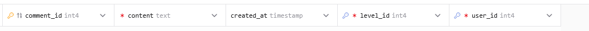
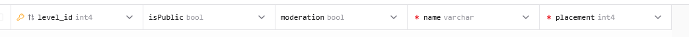

### `comments` (Нова таблиця)
---
Додає можливість текстового обговорення рівнів.
- **PK:** `comment_id`
- **Fields:** `content` (TEXT) для зберігання довгих повідомлень.
- **FK:** Посилається на `users` та `levels`.

    ```sql
    model comments {
    comment_id Int      @id @default(autoincrement())
    content    String
    created_at DateTime @default(now()) @db.Timestamp(6)
    user_id    Int
    level_id   Int
    levels     levels   @relation(fields: [level_id], references: [level_id], onDelete: Cascade)
    users      users    @relation(fields: [user_id], references: [user_id], onDelete: Cascade)
    }
    ```
  
- Також бeли додані поля **comments   comments[]** до таблиць **Users** та **Levels** 




### `isPublic` (Renamed)
---
Перейменування поля Users
 - public -> isPublic

     **До:**

    ```sql
    model levels {
    level_id   Int        @id @default(autoincrement())
    name       String     @db.VarChar(150)
    placement  Int
    moderation Boolean    @default(false)
    public   Boolean    @default(true)
    comments   comments[]
    votes      votes[]
    }
    ```

     **Після:**

    ```sql
    model levels {
    level_id   Int        @id @default(autoincrement())
    name       String     @db.VarChar(150)
    placement  Int
    moderation Boolean    @default(false)
    isPublic   Boolean    @default(true)
    comments   comments[]
    votes      votes[]
    }
    ```

 

